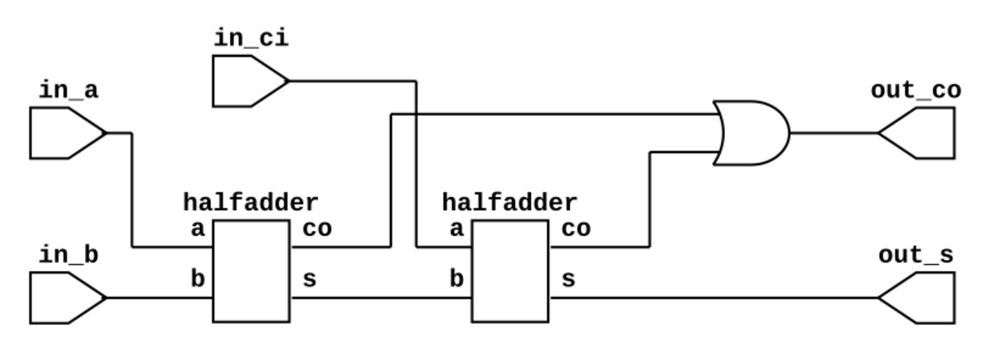
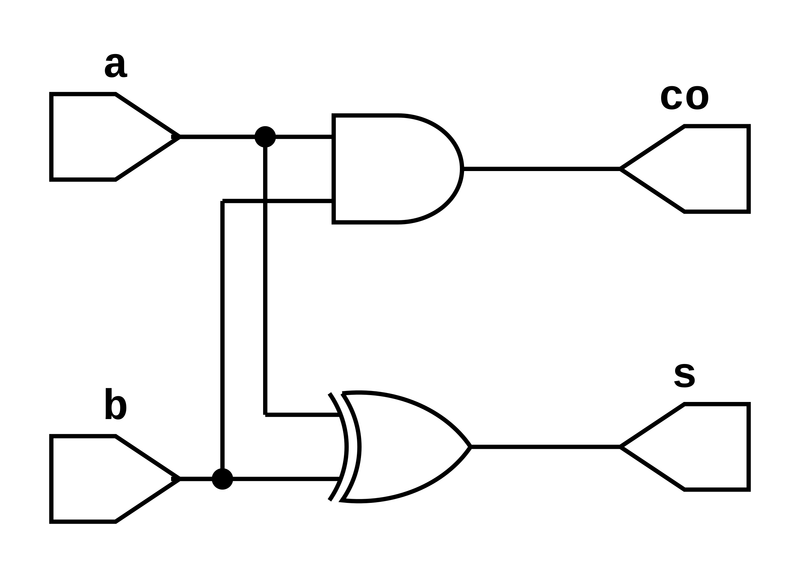

# Simulación de un sumador completo con entrada de argumentos por consola

* RTL del sumador completo



* RTL del medio sumador



## Simulación manual

1. Descargar el archivo [fulladder-with-arguments.zip](./fulladder-with-arguments.zip) que contiene el proyecto y descomprimir en el área de trabajo.

2. Crear el ejecutable *top.vvp* con iverilog:
```bash
iverilog -o top.vvp fulladder_tb.v fulladder.v halfadder.v
```

3. Iniciar la simulación y generar resultados, las entradas están en formato binario (101, etc)
```bash
vvp top.vvp +inputs=001 # Entrada con valor 1
vvp top.vvp +inputs=011 # Entrada con valor 2
vvp top.vvp +inputs=111 # Entrada con valor 3
```
El resultado será visto en la terminal.
> Para finalizar simulación: `> finsih`

4. Ver las formas de onda en gtkwave:
```bash
gtkwave top.vcd
```

* Podría también realizar la simulación creando un archivo
`./file_list.txt` que contiene los módulos que intervienen en la simulación:

```bash
iverilog -o top.vvp -c file_list.txt
vvp top.vvp # Con los argumentos anteriormente propuestos.
```

## Simulación a través de Makefile

Este proyecto contiene un `Makefile` que permite automatizar el proceso, para conocer
las diferentes opciones ejecute en la terminal el comando: `make help`

```bash
make sim        -> Simular diseño
make wave       -> Ver simulación en gtkwave
make rtl        -> Crear RTL
```
Para agregar la sumulación haciendo uso de *make* podrá agregar los
argumentos con `VVP_ARG=`, ejemplo:

```bash
make sim VVP_ARG=+inputs=001 # La salida debe ser 1
make sim VVP_ARG=+inputs=011 # La salida debe ser 2
make sim VVP_ARG=+inputs=111 # La salida debe ser 3
```

## Obtener los RTL

* RTL fulladder.v

```bash
make rtl rtl2png
```

* RTL halfadder.v

```bash
make rtl rtl2png TOP=halfadder
```

Regards,

Johnny
