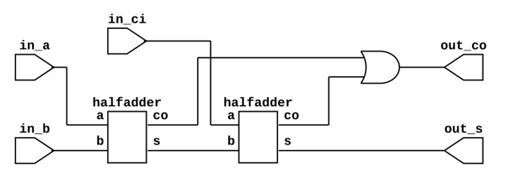
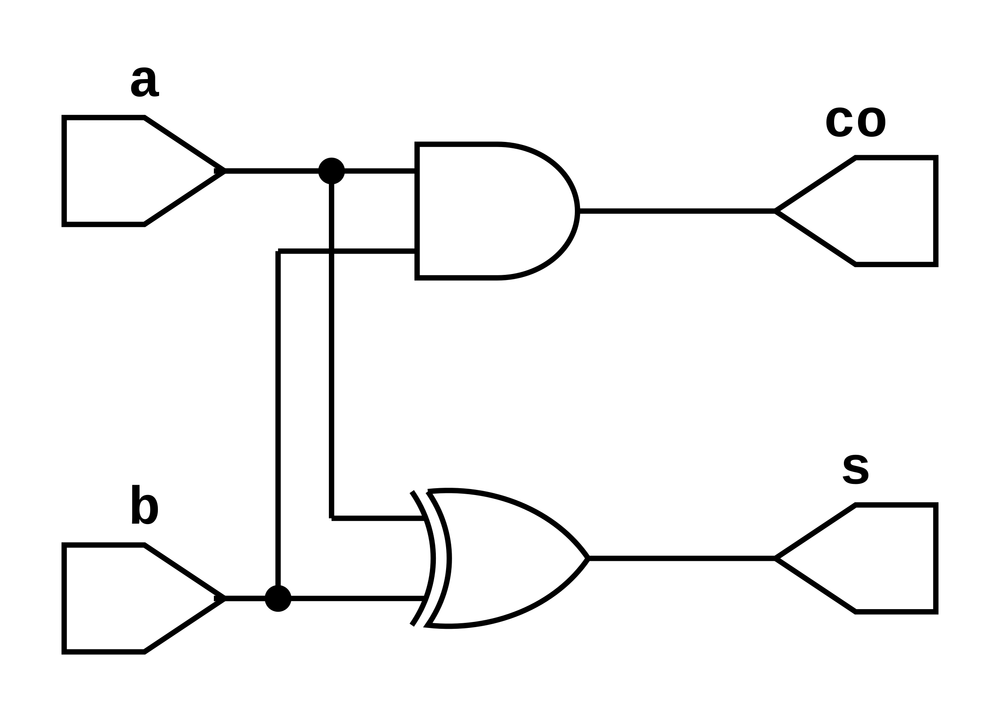

# Simulación de un sumador completo

Vídeo sobre la simulación aquí planteada:

[](https://www.youtube.com/watch?v=N9OJL0nyhSQ "Simulación de un circuito digital con herramientas opensource")

* RTL del sumador completo



* RTL del medio sumador



## Simulación manual

1. Descargar el archivo [prj.zip](./prj.zip) que contiene el proyecto y descomprimir en el área de trabajo.

2. Crear el ejecutable *top.vvp* con iverilog:
```bash
iverilog -o top.vvp fulladder_tb.v fulladder.v halfadder.v
```

3. Iniciar la simulación generar resultados
```bash
vvp top.vvp
```
> Para finalizar simulación: `> finsih`

4. Ver las formas de onda en gtkwave:
```bash
gtkwave top.vcd
```

* Podría también realizar la simulación creando un archivo
`./file_list.txt` que contiene los módulos que intervienen en la simulación:

```bash
iverilog -o top.vvp -c file_list.txt
vvp top.vvp
```

## Simulación a través de Makefile

Este proyecto contiene un `Makefile` que permite automatizar el proceso, para conocer
las diferentes opciones ejecute en la terminal el comando: `make help`

```bash
make sim        -> Simular diseño
make wave       -> Ver simulación en gtkwave
make rtl        -> Crear RTL
```

## Obtener los RTL

* RTL fulladder.v

```bash
make rtl rtl2png
```

* RTL halfadder.v

```bash
make rtl rtl2png TOP=halfadder
```

Regards,

Johnny
